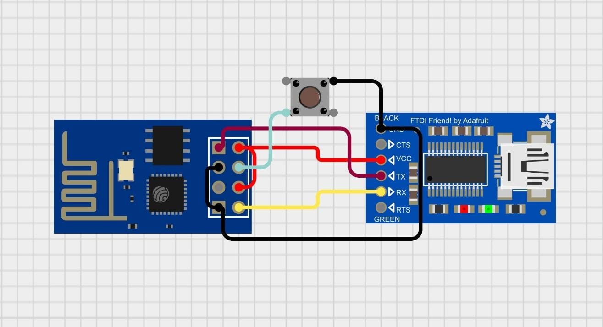

# 🌦️ Mini ESP-01 Weather Station 🌦️
An ultra-compact, low-power weather station using the ESP-01 module that gathers and transmits environmental data such as temperature, humidity, and pressure. Display the data on a local OLED screen or send it to a cloud service for remote monitoring.

#

  <a href="https://ibb.co/4wyvT96565j">
   

# 🔥 Key Features ✨
- 📊 Environmental Monitoring: Measure temperature, humidity, and atmospheric pressure.
- 🖥️ Local Display: View live data on a compact 0.96-inch OLED screen.
- 🌐 Remote Monitoring: Transmit data to cloud services for real-time monitoring.
- 🔋 Low-Power Operation: Powered by a 3.7V Li-Po battery for long-lasting performance.
- ⚙️ Compact & Efficient: A simple, space-saving design using the ESP-01 module.

# 🧰 Hardware Components 🛠️
Here are the core components of your weather station:

- ESP-01 Module: The heart of your weather station.
- 0.96-inch OLED Display: For displaying the data on-site.
- AMS1117 Regulator: To provide stable power to the ESP-01.
- TP4056 Lithium Battery Charging Module: For charging the Li-Po battery.
- 3.7V Li-Po 400mAh Battery: Provides power for your weather station.
- Slide Switch: Simple on/off control for power management.

# 📊 Circuit Diagram 🖱️
Here’s a simple and clear circuit diagram to guide your wiring setup:

  

Wiring Overview:
- ESP-01 to OLED: Use the SCL and SDA pins on the ESP-01 for I2C communication with the OLED.
- Sensor Connections: Connect your temperature and humidity sensor (e.g., DHT11 or BME280) to the GPIO pins of the ESP-01.
- Power Setup: Connect the Li-Po battery to the TP4056 module and use the AMS1117 regulator to provide a stable voltage to the ESP-01.

The circuit diagram shows how all the components are connected to the ESP-01 module. Here's a simplified breakdown:

- ESP-01 to OLED: The SCL and SDA pins of the OLED connect to the corresponding pins on the ESP-01 for I2C communication.
- Sensor Connections: The temperature and humidity sensor (e.g., DHT11 or BME280) is connected to the GPIO pins of the ESP-01 for reading environmental data.
- Battery and Charging: The Li-Po battery is connected to the TP4056 charging module, which also powers the AMS1117 regulator, supplying the ESP-01 and other components.

# 🏁 Getting Started 🚀
Follow these simple steps to get your weather station up and running:

1. 🔌 Connect the Hardware
Carefully wire all components as shown in the circuit diagram.
2. 💻 Install Required Software
Install the ESP8266/ESP32 Arduino Core (depending on your ESP module) in the Arduino IDE.
3. 🌐 Configure APIs
Set up Wi-Fi credentials and any necessary cloud service APIs for data transmission (like ThingSpeak, Blynk, etc.).
4. ⚡ Flash the Firmware
Use the Arduino IDE to upload the firmware to your ESP-01 module.
5. 🎤 Power On
Once powered on, check the OLED screen for real-time data or access the data remotely via the cloud service.
# 📜 Programming the ESP-01 💻
To program the ESP-01, you’ll need an external USB-to-serial adapter since the ESP-01 doesn’t have a built-in USB interface for flashing.

Steps to Flash:
1. Connect the ESP-01 to USB-to-Serial Adapter: Connect the TX/RX pins to the adapter.
2. Enter Flash Mode: Hold down the GPIO0 pin while powering on to put the ESP-01 into flash mode.
3. Upload Firmware: Use the Arduino IDE to upload your weather station code.
4. Verify Operation: Once the firmware is uploaded, your weather station should begin working as expected.

  

# 🚀 Ready to Go!
Once everything is set up and powered on, your Mini ESP-01 Weather Station will start collecting and displaying weather data on the OLED screen. You can also monitor it remotely via cloud services!
